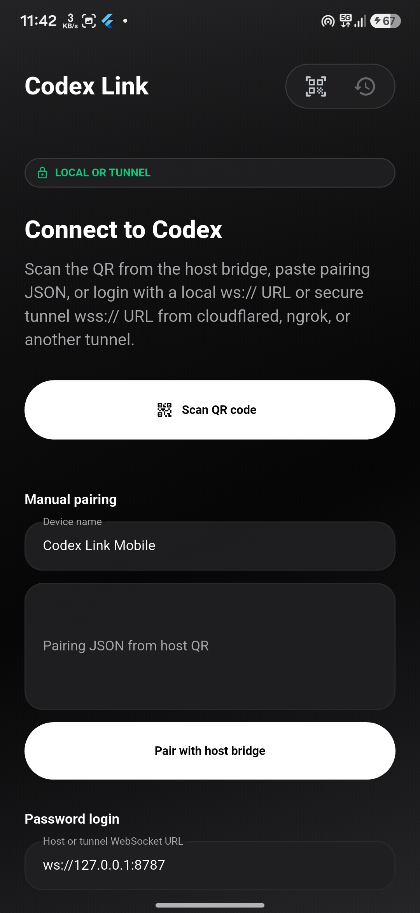
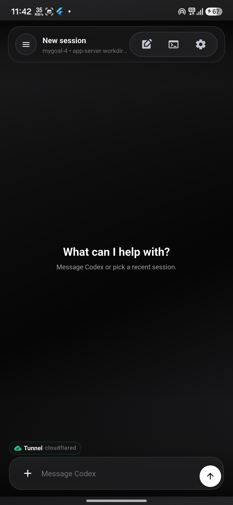
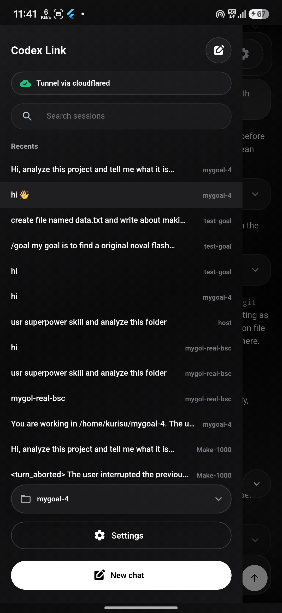
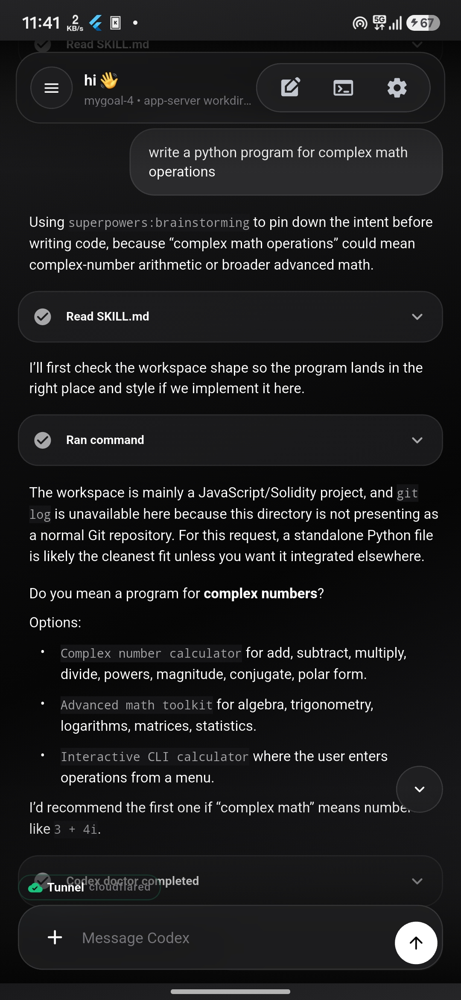

# Codex Link

Codex Link is a mobile controller for Codex. It pairs an Android Flutter app with a local host bridge so you can run Codex sessions, switch workspaces, inspect tool activity, receive files, and continue work from your phone.

The phone never talks to Codex directly. It connects to a small host bridge over LAN or a secure tunnel, and the host remains responsible for workspace access, sandbox mode, approvals, and file transfer.

```text
Flutter app -> WebSocket LAN/tunnel -> Host bridge -> Codex app-server
```

## Highlights

- ChatGPT-style Flutter chat UI with compact controls, dark/light themes, markdown, code blocks, and visible tool activity.
- Codex app-server bridge with sessions, goals, plans, approvals, model settings, workspace switching, and external session discovery.
- LAN pairing with QR/manual login plus tunnel-first remote access through cloudflared, ngrok, Tailscale, or another WebSocket-capable tunnel.
- Host-to-phone file transfer, image previews, `/send` file offers, and `@` file mentions from the active workspace.
- Android update checks through GitHub Releases.

## Screenshots

<table>
  <tr>
    <td></td>
    <td></td>
    <td></td>
    <td></td>
  </tr>
  <tr>
    <td align="center">Connect</td>
    <td align="center">Chat</td>
    <td align="center">Sidebar</td>
    <td align="center">Tool calls</td>
  </tr>
</table>

## Quick Start

```bash
pnpm install
pnpm --filter @codex-lan/host dev -- \
  --pair \
  --insecure-ws-dev \
  --session-mode app-server \
  --codex-command codex \
  --workdir /path/to/project \
  --sandbox workspace-write
```

The host prints a pairing QR/manual payload. Open the Flutter app, scan the QR code, then start a session.

For Android development:

```bash
cd flutter
flutter pub get
flutter run
```

## Documentation

- [Getting started](docs/GETTING_STARTED.md)
- [Host bridge](docs/HOST_BRIDGE.md)
- [Flutter app](docs/FLUTTER_APP.md)
- [Development and release](docs/DEVELOPMENT.md)
- [Security model](docs/SECURITY.md)

## Project Layout

```text
host/      TypeScript WebSocket bridge and Codex app-server adapter
flutter/   Flutter Android app
android/   Original Kotlin prototype retained for reference
shared/    Protocol schema reference
docs/      User, operator, and release documentation
```

## License

MIT. See [LICENSE](LICENSE).
